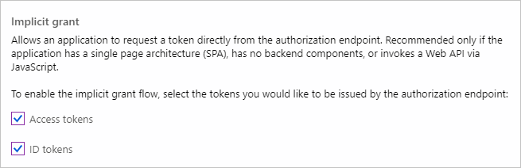
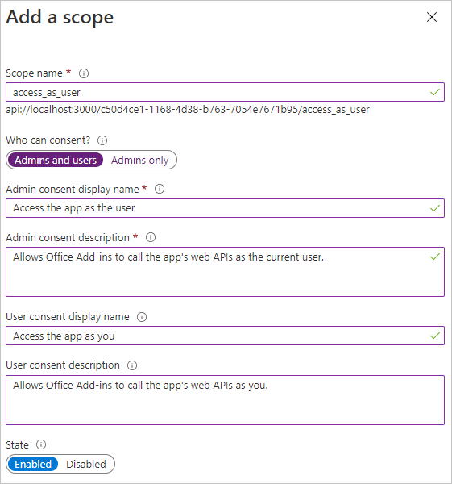

<!-- markdownlint-disable MD002 MD041 -->

Dans cet exercice, vous allez créer une inscription d'application web Azure AD à l'aide du Centre d'administration Azure Active Directory.

1. Ouvrez un navigateur et accédez au [Centre d’administration Azure Active Directory](https://aad.portal.azure.com). Connectez-vous à l’aide d’un **compte personnel** (compte Microsoft) ou d’un **compte professionnel ou scolaire**.

1. Sélectionnez **Azure Active Directory** dans le volet de navigation gauche, puis sélectionnez **Inscriptions d’applications** sous **Gérer**.

    

1. Sélectionnez **Nouvelle inscription**. Sur la page **Inscrire une application**, définissez les valeurs comme suit.

    - Définissez le **Nom** sur `Office Add-in Graph Tutorial`.
    - Définissez les **Types de comptes pris en charge** sur **Comptes dans un annuaire organisationnel et comptes personnels Microsoft**.
    - Sous **URI de redirection**, définissez la première flèche déroulante sur `Single-page application (SPA)`, et la valeur sur `https://localhost:3000/consent.html`.

    

1. Sélectionner **Inscription**. Dans la page Didacticiel Graph du **add-in Office,** copiez la valeur de **l'ID d'application (client)** et enregistrez-la. Vous en aurez besoin à l'étape suivante.

    

1. Sous **Gérer**, sélectionnez **Authentification**. Recherchez la section **d'octroi** implicite et activez **les jetons d'accès** et **les jetons d'ID.** Sélectionnez **Enregistrer**.

    

1. Sélectionnez **Certificats et secrets** sous **Gérer**. Sélectionnez le bouton **Nouveau secret client**. Entrez une valeur dans **Description**, sélectionnez une des options pour **Expire le**, puis sélectionnez **Ajouter**.

1. Copiez la valeur du secret client avant de quitter cette page. Vous en aurez besoin à l’étape suivante.

    > [!IMPORTANT]
    > Ce secret client n’apparaîtra plus jamais, aussi veillez à le copier maintenant.

1. Sélectionnez **les autorisations d'API** sous **Gérer,** puis **sélectionnez Ajouter une autorisation.**

1. Sélectionnez **Microsoft Graph,** puis **Autorisations déléguées.**

1. Sélectionnez les autorisations suivantes, puis **sélectionnez Ajouter des autorisations.**

    - **offline_access** - cela permet à l'application d'actualiser les jetons d'accès lorsqu'ils expirent.
    - **Calendars.ReadWrite** : cela permettra à l'application de lire et d'écrire dans le calendrier de l'utilisateur.
    - **MailboxSettings.Read** : cela permettra à l'application d'obtenir le fuseau horaire de l'utilisateur à partir de ses paramètres de boîte aux lettres.

    

## Configuration de l' sign-on unique du add-in Office

Dans cette section, vous allez mettre à jour l'inscription de l'application pour prendre en charge l' [sign-on unique (SSO)](https://docs.microsoft.com/office/dev/add-ins/develop/sso-in-office-add-ins)pour office.

1. Sélectionnez **Exposer une API.** Dans les **étendues définies par cette** section API, **sélectionnez Ajouter une étendue.** Lorsque vous y sont invités pour définir un **URI d'ID** d'application, définissez la valeur sur , en remplaçant `api://localhost:3000/YOUR_APP_ID_HERE` par `YOUR_APP_ID_HERE` l'ID d'application. Sélectionnez **Enregistrer et continuer.**

1. Remplissez les champs comme suit et sélectionnez **Ajouter une étendue.**

    - **Nom de l'étendue :**`access_as_user`
    - **Qui peut donner son consentement ? : Administrateurs et utilisateurs**
    - **Nom complet du consentement de l'administrateur :**`Access the app as the user`
    - **Description du consentement de l'administrateur :**`Allows Office Add-ins to call the app's web APIs as the current user.`
    - **Nom complet du consentement de l'utilisateur :**`Access the app as you`
    - **Description du consentement de l'utilisateur :**`Allows Office Add-ins to call the app's web APIs as you.`
    - **État : activé**

    

1. Dans la section **Applications clientes autorisées,** **sélectionnez Ajouter une application cliente.** Entrez un ID client dans la liste suivante, activez l'étendue sous **Étendues autorisées,** puis **sélectionnez Ajouter une application.** Répétez ce processus pour chacun des ID clients de la liste.

    - `d3590ed6-52b3-4102-aeff-aad2292ab01c` (Microsoft Office)
    - `ea5a67f6-b6f3-4338-b240-c655ddc3cc8e` (Microsoft Office)
    - `57fb890c-0dab-4253-a5e0-7188c88b2bb4` (Office sur le web)
    - `08e18876-6177-487e-b8b5-cf950c1e598c` (Office sur le web)
