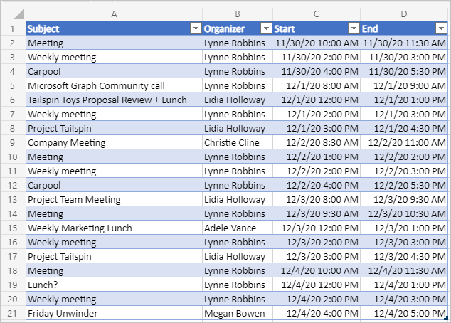

<!-- markdownlint-disable MD002 MD041 -->

Dans cet exercice, vous allez incorporer Microsoft Graph dans l'application. Pour cette application, vous allez utiliser la bibliothèque [cliente microsoft-graph-client](https://github.com/microsoftgraph/msgraph-sdk-javascript) pour effectuer des appels à Microsoft Graph.

## <a name="get-calendar-events-from-outlook"></a>Récupérer les événements de calendrier à partir d’Outlook

Commencez par ajouter une API pour obtenir un [affichage Calendrier](https://docs.microsoft.com/graph/api/user-list-calendarview) à partir du calendrier de l'utilisateur.

1. Ouvrez **./src/api/graph.ts** et ajoutez les `import` instructions suivantes en haut du fichier.

    ```typescript
    import { zonedTimeToUtc } from 'date-fns-tz';
    import { findIana } from 'windows-iana';
    import * as graph from '@microsoft/microsoft-graph-client';
    import { Event, MailboxSettings } from 'microsoft-graph';
    import 'isomorphic-fetch';
    import { getTokenOnBehalfOf } from './auth';
    ```

1. Ajoutez la fonction suivante pour initialiser le SDK Microsoft Graph et renvoyer un **client.**

    :::code language="typescript" source="../demo/graph-tutorial/src/api/graph.ts" id="GetClientSnippet":::

1. Ajoutez la fonction suivante pour obtenir le fuseau horaire de l'utilisateur à partir de ses paramètres de boîte aux lettres et pour convertir cette valeur en identificateur de fuseau horaire IANA.

    :::code language="typescript" source="../demo/graph-tutorial/src/api/graph.ts" id="GetTimeZonesSnippet":::

1. Ajoutez la fonction suivante (sous la `const graphRouter = Router();` ligne) pour implémenter un point de terminaison d'API ( `GET /graph/calendarview` ).

    :::code language="typescript" source="../demo/graph-tutorial/src/api/graph.ts" id="GetCalendarViewSnippet":::

    Considérez ce que fait ce code.

    - Il obtient le fuseau horaire de l'utilisateur et l'utilise pour convertir le début et la fin de l'affichage Calendrier demandé en valeurs UTC.
    - Il s'agit `GET` du point de `/me/calendarview` terminaison de l'API Graph.
        - Elle utilise la fonction pour définir l'en-tête, ce qui a pour effet d'ajuster les heures de début et de fin des événements renvoyés au fuseau horaire de `header` `Prefer: outlook.timezone` l'utilisateur.
        - Il utilise la fonction pour ajouter les paramètres et définir le début et la `query` `startDateTime` fin de `endDateTime` l'affichage Calendrier.
        - Il utilise la `select` fonction pour demander uniquement les champs utilisés par le module.
        - Elle utilise la `orderby` fonction pour trier les résultats par heure de début.
        - Il utilise la `top` fonction pour limiter à 25 les résultats d'une seule requête.
    - Il utilise un **objet PageIteratorCallback** pour [itérer](https://docs.microsoft.com/graph/sdks/paging) dans les résultats et effectuer des demandes supplémentaires si d'autres pages de résultats sont disponibles.

## <a name="update-the-ui"></a>Mettre à jour l'interface utilisateur

Maintenant, nous allons mettre à jour le volet Des tâches pour permettre à l'utilisateur de spécifier une date de début et de fin pour l'affichage Calendrier.

1. Ouvrez **./src/addin/taskpane.js** et remplacez la fonction `showMainUi` existante par ce qui suit.

    :::code language="javascript" source="../demo/graph-tutorial/src/addin/taskpane.js" id="MainUiSnippet":::

    Ce code ajoute un formulaire simple afin que l'utilisateur puisse spécifier une date de début et de fin. Il implémente également un second formulaire pour la création d'un événement. Ce formulaire n'a rien à faire pour le moment, vous allez implémenter cette fonctionnalité dans la section suivante.

1. Ajoutez le code suivant au fichier pour créer une table dans la feuille de calcul active contenant les événements extraits de l'affichage Calendrier.

    :::code language="javascript" source="../demo/graph-tutorial/src/addin/taskpane.js" id="WriteToSheetSnippet":::

1. Ajoutez la fonction suivante pour appeler l'API d'affichage calendrier.

    :::code language="javascript" source="../demo/graph-tutorial/src/addin/taskpane.js" id="GetCalendarSnippet":::

1. Enregistrez toutes vos modifications, redémarrez le serveur et actualisez le volet Des tâches dans Excel (fermez les volets Des tâches ouverts et ré-ouvrez- le).

    

1. Choisissez les dates de début et de fin, **puis** importer.

    
