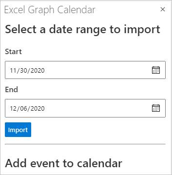

<!-- markdownlint-disable MD002 MD041 -->

<span data-ttu-id="10078-101">Dans cet exercice, vous allez incorporer Microsoft Graph dans l'application.</span><span class="sxs-lookup"><span data-stu-id="10078-101">In this exercise you will incorporate Microsoft Graph into the application.</span></span> <span data-ttu-id="10078-102">Pour cette application, vous allez utiliser la bibliothèque [cliente microsoft-graph-client](https://github.com/microsoftgraph/msgraph-sdk-javascript) pour effectuer des appels à Microsoft Graph.</span><span class="sxs-lookup"><span data-stu-id="10078-102">For this application, you will use the [microsoft-graph-client](https://github.com/microsoftgraph/msgraph-sdk-javascript) library to make calls to Microsoft Graph.</span></span>

## <a name="get-calendar-events-from-outlook"></a><span data-ttu-id="10078-103">Récupérer les événements de calendrier à partir d’Outlook</span><span class="sxs-lookup"><span data-stu-id="10078-103">Get calendar events from Outlook</span></span>

<span data-ttu-id="10078-104">Commencez par ajouter une API pour obtenir un [affichage Calendrier](https://docs.microsoft.com/graph/api/user-list-calendarview) à partir du calendrier de l'utilisateur.</span><span class="sxs-lookup"><span data-stu-id="10078-104">Start by adding an API to get a [calendar view](https://docs.microsoft.com/graph/api/user-list-calendarview) from the user's calendar.</span></span>

1. <span data-ttu-id="10078-105">Ouvrez **./src/api/graph.ts** et ajoutez les `import` instructions suivantes en haut du fichier.</span><span class="sxs-lookup"><span data-stu-id="10078-105">Open **./src/api/graph.ts** and add the following `import` statements to the top of the file.</span></span>

    ```typescript
    import { zonedTimeToUtc } from 'date-fns-tz';
    import { findIana } from 'windows-iana';
    import * as graph from '@microsoft/microsoft-graph-client';
    import { Event, MailboxSettings } from 'microsoft-graph';
    import 'isomorphic-fetch';
    import { getTokenOnBehalfOf } from './auth';
    ```

1. <span data-ttu-id="10078-106">Ajoutez la fonction suivante pour initialiser le SDK Microsoft Graph et renvoyer un **client.**</span><span class="sxs-lookup"><span data-stu-id="10078-106">Add the following function to initialize the Microsoft Graph SDK and return a **Client**.</span></span>

    :::code language="typescript" source="../demo/graph-tutorial/src/api/graph.ts" id="GetClientSnippet":::

1. <span data-ttu-id="10078-107">Ajoutez la fonction suivante pour obtenir le fuseau horaire de l'utilisateur à partir de ses paramètres de boîte aux lettres et pour convertir cette valeur en identificateur de fuseau horaire IANA.</span><span class="sxs-lookup"><span data-stu-id="10078-107">Add the following function to get the user's time zone from their mailbox settings, and to convert that value to an IANA time zone identifier.</span></span>

    :::code language="typescript" source="../demo/graph-tutorial/src/api/graph.ts" id="GetTimeZonesSnippet":::

1. <span data-ttu-id="10078-108">Ajoutez la fonction suivante (sous la `const graphRouter = Router();` ligne) pour implémenter un point de terminaison d'API ( `GET /graph/calendarview` ).</span><span class="sxs-lookup"><span data-stu-id="10078-108">Add the following function (below the `const graphRouter = Router();` line) to implement an API endpoint (`GET /graph/calendarview`).</span></span>

    :::code language="typescript" source="../demo/graph-tutorial/src/api/graph.ts" id="GetCalendarViewSnippet":::

    <span data-ttu-id="10078-109">Considérez ce que fait ce code.</span><span class="sxs-lookup"><span data-stu-id="10078-109">Consider what this code does.</span></span>

    - <span data-ttu-id="10078-110">Il obtient le fuseau horaire de l'utilisateur et l'utilise pour convertir le début et la fin de l'affichage Calendrier demandé en valeurs UTC.</span><span class="sxs-lookup"><span data-stu-id="10078-110">It gets the user's time zone and uses that to convert the start and end of the requested calendar view into UTC values.</span></span>
    - <span data-ttu-id="10078-111">Il s'agit `GET` du point de `/me/calendarview` terminaison de l'API Graph.</span><span class="sxs-lookup"><span data-stu-id="10078-111">It does a `GET` to the `/me/calendarview` Graph API endpoint.</span></span>
        - <span data-ttu-id="10078-112">Elle utilise la fonction pour définir l'en-tête, ce qui a pour effet d'ajuster les heures de début et de fin des événements renvoyés au fuseau horaire de `header` `Prefer: outlook.timezone` l'utilisateur.</span><span class="sxs-lookup"><span data-stu-id="10078-112">It uses the `header` function to set the `Prefer: outlook.timezone` header, causing the start and end times of the returned events to be adjusted to the user's time zone.</span></span>
        - <span data-ttu-id="10078-113">Il utilise la fonction pour ajouter les paramètres et définir le début et la `query` `startDateTime` fin de `endDateTime` l'affichage Calendrier.</span><span class="sxs-lookup"><span data-stu-id="10078-113">It uses the `query` function to add the `startDateTime` and `endDateTime` parameters, setting the start and end of the calendar view.</span></span>
        - <span data-ttu-id="10078-114">Il utilise la `select` fonction pour demander uniquement les champs utilisés par le module.</span><span class="sxs-lookup"><span data-stu-id="10078-114">It uses the `select` function to request only the fields used by the add-in.</span></span>
        - <span data-ttu-id="10078-115">Elle utilise la `orderby` fonction pour trier les résultats par heure de début.</span><span class="sxs-lookup"><span data-stu-id="10078-115">It uses the `orderby` function to sort the results by the start time.</span></span>
        - <span data-ttu-id="10078-116">Il utilise la `top` fonction pour limiter à 25 les résultats d'une seule requête.</span><span class="sxs-lookup"><span data-stu-id="10078-116">It uses the `top` function to limit the results in a single request to 25.</span></span>
    - <span data-ttu-id="10078-117">Il utilise un **objet PageIteratorCallback** pour [itérer](https://docs.microsoft.com/graph/sdks/paging) dans les résultats et effectuer des demandes supplémentaires si d'autres pages de résultats sont disponibles.</span><span class="sxs-lookup"><span data-stu-id="10078-117">It uses a **PageIteratorCallback** object to [iterate through the results](https://docs.microsoft.com/graph/sdks/paging) and to make additional requests if more pages of results are available.</span></span>

## <a name="update-the-ui"></a><span data-ttu-id="10078-118">Mettre à jour l'interface utilisateur</span><span class="sxs-lookup"><span data-stu-id="10078-118">Update the UI</span></span>

<span data-ttu-id="10078-119">Maintenant, nous allons mettre à jour le volet Des tâches pour permettre à l'utilisateur de spécifier une date de début et de fin pour l'affichage Calendrier.</span><span class="sxs-lookup"><span data-stu-id="10078-119">Now let's update the task pane to allow the user to specify a start and end date for the calendar view.</span></span>

1. <span data-ttu-id="10078-120">Ouvrez **./src/addin/taskpane.js** et remplacez la fonction `showMainUi` existante par ce qui suit.</span><span class="sxs-lookup"><span data-stu-id="10078-120">Open **./src/addin/taskpane.js** and replace the existing `showMainUi` function with the following.</span></span>

    :::code language="javascript" source="../demo/graph-tutorial/src/addin/taskpane.js" id="MainUiSnippet":::

    <span data-ttu-id="10078-121">Ce code ajoute un formulaire simple afin que l'utilisateur puisse spécifier une date de début et de fin.</span><span class="sxs-lookup"><span data-stu-id="10078-121">This code adds a simple form so the user can specify a start and end date.</span></span> <span data-ttu-id="10078-122">Il implémente également un second formulaire pour la création d'un événement.</span><span class="sxs-lookup"><span data-stu-id="10078-122">It also implements a second form for creating a new event.</span></span> <span data-ttu-id="10078-123">Ce formulaire n'a rien à faire pour le moment, vous allez implémenter cette fonctionnalité dans la section suivante.</span><span class="sxs-lookup"><span data-stu-id="10078-123">That form doesn't do anything for now, you'll implement that feature in the next section.</span></span>

1. <span data-ttu-id="10078-124">Ajoutez le code suivant au fichier pour créer une table dans la feuille de calcul active contenant les événements extraits de l'affichage Calendrier.</span><span class="sxs-lookup"><span data-stu-id="10078-124">Add the following code to the file to create a table in the active worksheet containing the events retrieved from the calendar view.</span></span>

    :::code language="javascript" source="../demo/graph-tutorial/src/addin/taskpane.js" id="WriteToSheetSnippet":::

1. <span data-ttu-id="10078-125">Ajoutez la fonction suivante pour appeler l'API d'affichage calendrier.</span><span class="sxs-lookup"><span data-stu-id="10078-125">Add the following function to call the calendar view API.</span></span>

    :::code language="javascript" source="../demo/graph-tutorial/src/addin/taskpane.js" id="GetCalendarSnippet":::

1. <span data-ttu-id="10078-126">Enregistrez toutes vos modifications, redémarrez le serveur et actualisez le volet Des tâches dans Excel (fermez les volets Des tâches ouverts et ré-ouvrez- le).</span><span class="sxs-lookup"><span data-stu-id="10078-126">Save all of your changes, restart the server, and refresh the task pane in Excel (close any open task panes and re-open).</span></span>

    

1. <span data-ttu-id="10078-128">Choisissez les dates de début et de fin, **puis** importer.</span><span class="sxs-lookup"><span data-stu-id="10078-128">Choose start and end dates and choose **Import**.</span></span>

    
